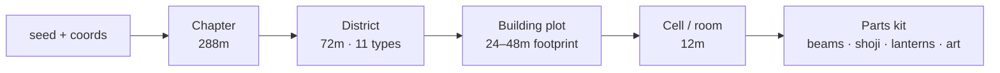

# 無限城 — Mugen-jō · The Infinity Castle

An endless, seed-deterministic Japanese castle that assembles itself around you in real time — and you are a crow, free to fly anywhere inside it. Built with Three.js and **zero external art assets**: every beam, lantern, painting, mote of ash and wooden clack is generated by code at runtime. The only shipped files are the background theme and the entrance sting.

> Inspired by the Infinity Castle of *Demon Slayer* — an architectural organism with no ground, no sky, and no single "up".

**Fly it:** press **TAKE WING** and dive. Add `?seed=99` to the URL to revisit or share an exact castle.

---

## Highlights

- **Infinite, deterministic world** — the same seed always grows the same castle, in every direction, forever
- **Architectural grammar, not noise soup** — chapters → districts → building plots → rooms → parts, so everything reads as *intentional* architecture
- **The castle is alive** — districts rotate and drift, reconfiguration waves roll through with a biwa cry, buildings assemble and retract piece by piece
- **Free 6-DOF crow flight** — full loops, inverted flight, Q/E rolls; the camera follows *your* up, not the world's
- **Weather as a dial** — six atmospheres (still air → ember storm → spirit mist) with user override, plus extreme sliders for mist, density, speed and motion
- **A constant construction soundscape** — synthesized clacks, sliding shoji, hammering, groaning beams and settling stone, whose intensity follows the actual generation rate
- **Runs everywhere** — auto-detected quality tiers from integrated laptops to 120 Hz desktops, full touch support with a floating joystick

---

## How the world is generated

The generator's core idea: **treat the castle as one infinitely large building, not scattered rooms.** Everything below is deterministic — derived from `hash(coordinates, seed)` with zero stored state, so any point in space can be answered independently, in any order.

### 1. The spatial hierarchy

```text
Chapter (288 m)   a "biome band" — authored sequences of district types, biased by depth
  └── District (72 m = 6×6×6 cells)   one of 11 archetypes with its own shape grammar
        └── Cell (12 m)               one room/void, built from an archetype recipe
              └── Parts               floors, pillars, shoji, lanterns, art, clutter
```



**Districts** are the personality unit: residential wards, lantern labyrinths, corridor canyons, hollow shafts, temples, bridge webs, hanging gardens, cathedral voids… Each defines a *shape grammar* (`shapeAllows`) — which cells of its 6³ lattice may hold architecture — plus fill density, window styles, motion behaviour and fog character. Chapters weight which districts appear at which depth, so descending feels like travelling through regions rather than shuffling tiles.

### 2. Building plots — why nothing is ever half a house

Filling cells independently produces eroded rubble. Instead, the ground plan of every district is divided into **plots** of 2×2 cells (one block in four merges into a 4×4 mansion). Each plot decides **once** — via one hash — whether it is built, which vertical band it occupies, and its architectural style (*machiya*, *kura*, *yagura*, *tenshu*…). Every cell then simply asks "which plot owns my column?" — so every building is complete, roofed, and styled coherently from foundation to ridge, even though no two cells are ever generated together.

Carved through the plots are single-cell **flight corridors**, light wells and atria — the negative space that makes the castle flyable. Plots verify their entire footprint against these voids, so streets stay open and no tower is ever sliced by a corridor.

### 3. Rooms from a parts kit

Each built cell picks an **archetype** (tatami hall, stair shaft, balcony ring, pillar forest, cathedral bay…) and constructs itself from a procedural kit: post-and-beam frames, shoji lattices with lit paper, plank floors, hip/gable/thatch roofs, engawa verandas with aligned bay posts, hanging chōchin lanterns (85 % amber, 9 % jade, 6 % indigo), painted fusuma and byōbu sampling a **runtime-painted art atlas**, and signs of life — irori hearths, tea sets, futons, drying racks, laundry lines. All geometry per cell is merged into ~2 draw calls with vertex-baked ambient occlusion and warm gradients.

### 4. Streaming, and the sequential assembly

Three shells stream around the player, sorted so cells **ahead of your flight vector** build first:

| shell | radius | content |
| --- | --- | --- |
| cells | ~4–4.6 cells | full architecture, built within a per-frame time budget |
| landmarks | ~2.6 districts | pagodas, great gates, monumental torii |
| far field | ~5 districts | 1-draw-call district proxies with procedural window grids |

Nothing pops. Every part carries its centroid and a build-order hash to the vertex shader; new architecture **flies in along your direction of travel** and settles piece by piece, evicted cells dissolve the same way in reverse, and far proxies hold their ground until real cells actually generate there — then drift back and melt into the aerial haze. The whole animation costs one `mix()` in the vertex shader.

### 5. Distance is hidden by air, not fog-to-black

Classic aerial perspective, inverted for this world: distance goes **hot**, not dark. Surfaces fade toward a glowing amber horizon (the castle "burning" infinitely far below), layered mist decks drift between buildings (18 quads, one draw call), and airborne motes — embers, ash, spirit jade — fall or rise per weather. Six weather presets crossfade over district pools and a 90-second global cycle, or the player pins one from settings.

### 6. Motion without breaking physics

Districts rotate and drift as rigid bodies — collision transforms the query point into each district's local frame first, so you can land on a slowly turning tower. Reconfiguration waves periodically roll outward with a taiko boom and biwa phrase; buildings caught in the front visibly rebuild themselves.

### 7. Sound is (almost) all mathematics

Apart from the theme and entrance sting, every sound is synthesized in the Web Audio API: Karplus-Strong biwa plucks, filtered-noise wind that tracks airspeed, wing flaps, wooden collision knocks — and a **construction soundscape** driven by the live cell-build rate: three looping beds (timber rumble, groaning beams, sifting grit) plus a stream of stereo-panned carpentry one-shots (hyōshigi clacks, rapid hammering, sliding shoji with frame thunks, masonry sub-thumps). A master compressor glues it to the music.

---

## Requirements

- A current browser with WebGL 2 and Web Audio support
- Node.js 24 (see `.nvmrc`), npm 11+

## Getting started

```sh
npm install
npm run dev
```

Open the printed URL and press **TAKE WING**. Useful URLs:

```text
?seed=99          load a specific castle
?dev=parts        orbit-view gallery of kit pieces
?dev=modules      gallery of complete generated rooms
```

## Controls

| Desktop | Action |
| --- | --- |
| Mouse / arrows / `A` `D` | Steer (full 3-D — no pitch limit) |
| `Q` / `E` | Roll |
| `Space` / `W` / click | Surge |
| `Shift` / `S` | Brake & hover |
| `C` | First-person camera |
| `H` | Hide HUD (photo mode) |
| `R` | Grow a new castle |
| `M` | Mute |
| `Esc` | Free the cursor → **⛩ settings** (top centre) |

Touch: floating left-side joystick (appears under your thumb), right-side drag to look, FLAP/BRAKE buttons.

**Settings** (⛩): quality (auto-detected from your GPU), castle motion, weather, mist amount, flight speed, world density, music/sfx volume, invert Y, ghost mode, seed — most sliders are deliberately *extreme* at their ends.

## Scripts

| Command | Purpose |
| --- | --- |
| `npm run dev` | Vite dev server |
| `npm run typecheck` | TypeScript check |
| `npm run build` | Production build → `dist/` |
| `npm run preview` | Preview the build |

## Deployment

Pushing to `main` deploys automatically to **GitHub Pages** via [.github/workflows/deploy.yml](.github/workflows/deploy.yml) (typecheck → build → upload artifact → deploy). One-time setup: repository **Settings → Pages → Source → GitHub Actions**. Vite's `base: './'` plus relative asset paths make the build location-independent, so it works at any repo path.

## Architecture

```text
src/
├── audio/    Web Audio synthesis — buses, construction soundscape, biwa, wind
├── core/     renderer, quality tiers + GPU detection, seeded hashing
├── dev/      procedural geometry galleries
├── fx/       sky shells, mist decks, motes, weather, bloom
├── input/    pointer-lock mouse, keyboard, floating touch stick
├── kit/      geometry kit, shared shader materials, art atlas
├── physics/  district-frame sphere collision + escape
├── player/   crow (with wing-wash aerodynamics), 6-DOF flight, camera rig
├── ui/       intro, tour, HUD, settings
└── world/    districts, plots, archetypes, landmarks, streaming, motion
```

## Community

- Read [CONTRIBUTING.md](CONTRIBUTING.md) before proposing a change.
- Follow the standards in [CODE_OF_CONDUCT.md](CODE_OF_CONDUCT.md) when participating.
- Report vulnerabilities privately according to [SECURITY.md](SECURITY.md).

## License

Licensed under the [MIT License](LICENSE). The bundled theme and entrance audio are user-provided media, not covered by the code license.
