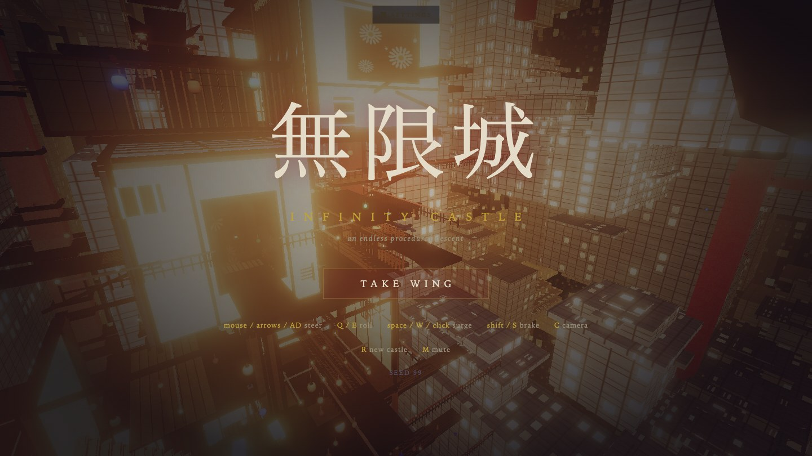
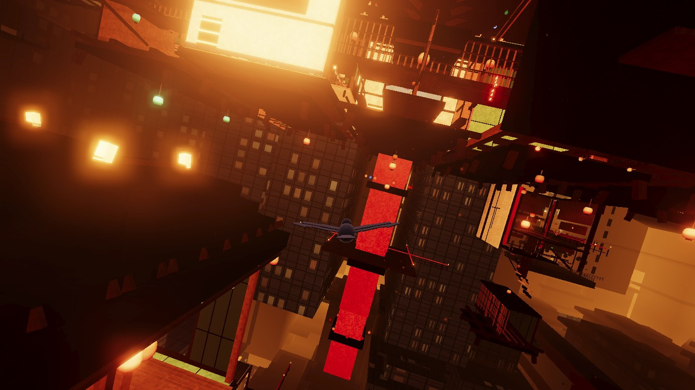
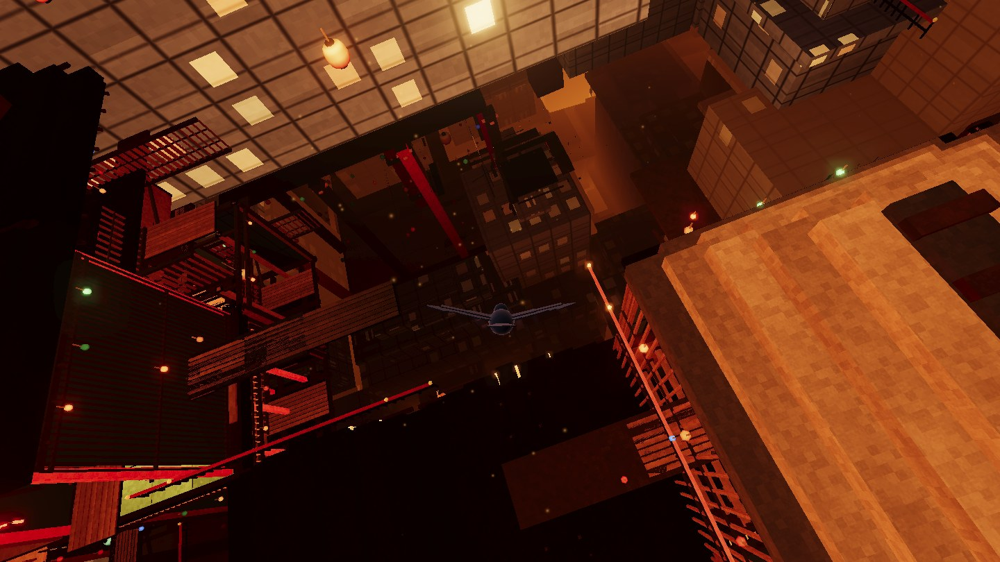
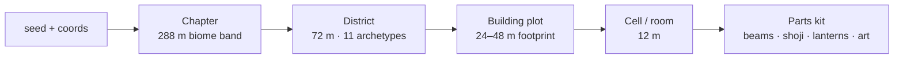
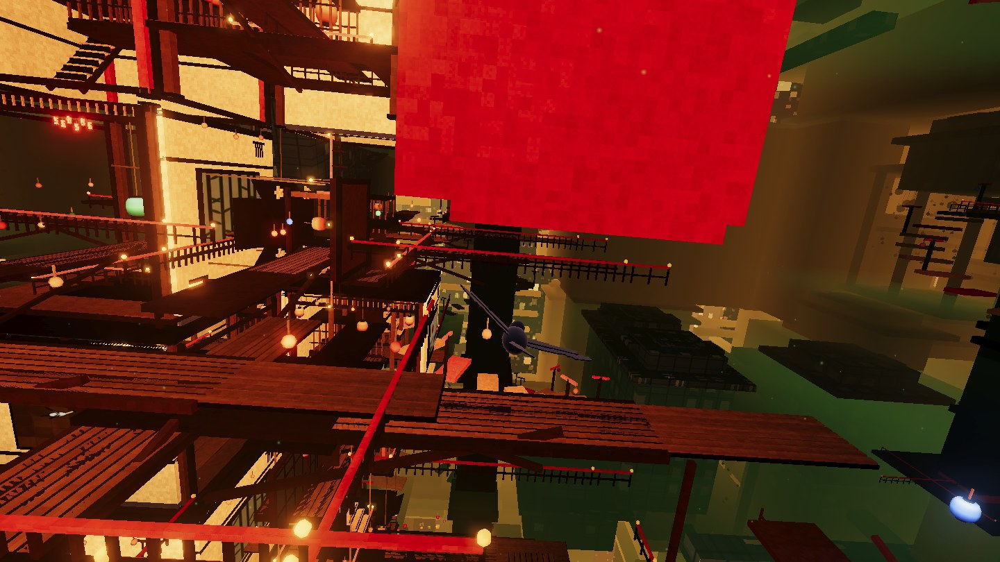
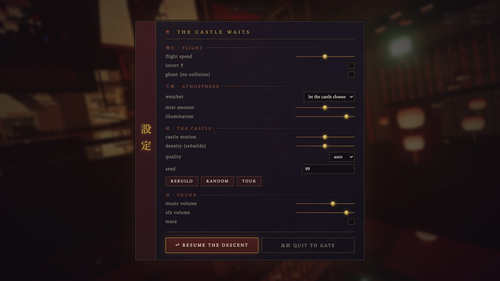

<div align="center">

# 無限城

### M U G E N - J Ō &nbsp;·&nbsp; T H E &nbsp; I N F I N I T Y &nbsp; C A S T L E

**An infinite Japanese castle that builds itself around you — and you are a crow.**

[**▶ FLY IT NOW**](https://thre4dripper.github.io/Infinity-Castle-ThreeJs/) · zero installs, straight in your browser



</div>

There is no ground here. No sky. No single *up*. Just an endless organism of timber and lantern-light, rearranging itself to the cry of a biwa — and every screw, shoji panel, painted byōbu and drifting ember you see was **generated by code the moment you arrived**. No 3D models. No textures. No sound packs. One repo, one seed, infinite castle.

> Inspired by the Infinity Castle of *Demon Slayer: Kimetsu no Yaiba*.

---

## The descent

|   |   |
|---|---|
|  |  |
| *Diving a labyrinth ward — every building complete, styled, inhabited* | *The lantern ocean under an ember storm — straight down forever* |

- 🏮 **It never ends, and it never repeats itself into mush.** The world is grown from an *architectural grammar* — chapters of districts, districts of building plots, plots of rooms — so every seed produces intentional streets, shrines and towers, not noise soup.
- 🐦‍⬛ **True free flight.** Full loops. Inverted dives. Q/E barrel rolls. The camera follows *your* up — after a half-loop, only the hanging lanterns will tell you which way the world thinks is down.
- 🌊 **The castle is alive.** Districts turn and drift like slow machines. Reconfiguration waves roll through with a taiko boom, and architecture visibly *assembles ahead of you and unwinds behind you*, piece by piece.
- 🌫️ **Weather you can grab.** Still air, warm haze, mist fall, ember storm, ash fall, spirit mist — the castle cycles them, or you pin one. Every slider in the menu is deliberately extreme at its ends.
- 🔊 **A world you can hear being built.** Wooden clacks, rapid hammering, sliding shoji, groaning beams, settling stone — a constant synthesized construction soundscape whose intensity follows the *actual generation rate*, under the looping theme.
- 📱 **Runs on nearly anything.** GPU-detected quality tiers, adaptive frame-time monitor, full touch controls with a floating joystick.

---

## How an infinite castle is generated

The core trick: **treat the castle as one infinitely large building.** Every question — *"is there a wall at (x, y, z)?"* — is answered by pure hashing of coordinates + seed. No stored state, no generation order, no borders. Any point in space can be resolved independently, which is what makes streaming in any direction trivial.



### Districts give the castle personality
Eleven archetypes — residential wards, lantern labyrinths, corridor canyons, hollow shafts, hanging temples, bridge webs, cathedral voids… Each brings a *shape grammar* (which cells of its 6×6×6 lattice may hold architecture), a fill density, motion behaviour, window style and fog character. **Chapters** weight which districts appear at which depth, so descending feels like crossing regions of one megastructure.

### Building plots guarantee complete houses
Naive per-cell filling erodes buildings into rubble. Instead, each district's plan is divided into **2×2-cell plots** (one block in four merges into a 4×4 mansion). A single hash decides the plot's fate — built or void, foundation level, height, and style (*machiya*, *kura*, *yagura*, *tenshu*) — and every cell then asks *"which plot owns my column?"* The result: 100 % of buildings are complete from foundation to roof ridge, even though no two cells are ever generated together. Single-cell flight corridors, light wells and atria are carved through as guaranteed negative space.

### Rooms are furnished by a parts kit
Each cell picks an archetype recipe — tatami hall, stair shaft, balcony ring, pillar forest, cathedral bay — and builds itself from procedural parts: post-and-beam frames, glowing shoji lattices, engawa verandas, hip/gable/thatch roofs, chōchin lanterns (85 % amber, 9 % jade, 6 % indigo — some breathing, some flickering), fusuma and byōbu paintings sampled from a **runtime-painted art atlas**, plus signs of life: irori hearths, tea sets, futons, laundry lines, drying persimmons. Everything in a cell merges to ~2 draw calls with vertex-baked ambient occlusion.

### Streaming that never pops
Three shells surround the player — full cells (~55 m, built within a per-frame time budget, **prioritised along your flight vector**), landmarks (~190 m), and one-draw-call far proxies (~360 m) that carry procedural window grids and the same lighting as real architecture. Every part knows its centroid and build order, so new architecture *flies in from the haze ahead* and settles; evicted rooms unwind behind you; proxies hold their ground until real cells actually generate, then melt into the aerial perspective — which here goes **hot, not dark**: the distance burns amber, like the castle's own furnace horizon.

### Physics on moving architecture
Districts move as rigid bodies, so collision transforms your position into each district's local frame before testing — you can graze a slowly rotating tower at 40 m/s and the walls stay solid.

### Sound from mathematics
Karplus-Strong biwa strings. Filtered-noise wind that tracks airspeed. And the construction soundscape: three looping beds (timber rumble, groaning beams, sifting grit) plus stereo-panned carpentry one-shots, all driven per-frame by cells-built-per-second, glued to the theme by a master compressor.

|   |   |
|---|---|
|  |  |
| *Spirit mist pooling in the hanging temples* | *ESC — the castle waits: every dial, styled like a shrine* |

---

## Take wing

```sh
npm install
npm run dev
```

**Every setting lives in the URL** — seed, weather, density, illumination, volumes — so a refresh keeps your world and a link *shares* it:

```text
?seed=99&weather=emberstorm&mist=170&density=140&light=120
?dev=parts      # orbit-view gallery of every kit piece
?dev=modules    # gallery of complete generated rooms
```

| Desktop | Action |
| --- | --- |
| Mouse / arrows / `A` `D` | Steer — full 3-D, no limits |
| `Q` / `E` | Roll |
| `Space` / `W` / click | Surge |
| `Shift` / `S` | Brake & hover |
| `Esc` | **Pause — the shrine menu** (weather, density, illumination, speed, sound, quit) |
| `C` / `H` / `R` / `M` | Camera / hide HUD / new castle / mute |

Touch: joystick appears wherever your left thumb lands, right side drags to look, FLAP/BRAKE buttons.

## Deployment

Push to `main` → GitHub Actions typechecks, builds and deploys to Pages ([.github/workflows/deploy.yml](.github/workflows/deploy.yml)). One-time setup: **Settings → Pages → Source → GitHub Actions**. `base: './'` and relative asset paths make the build work at any URL.

**Moving to a custom domain** is a one-variable change. Set a repository variable `SITE_URL` (*Settings → Secrets and variables → Actions → Variables*), e.g. `https://castle.example.dev/`, and the build regenerates the canonical link, Open Graph and Twitter tags, JSON-LD, `sitemap.xml`, `robots.txt` — and writes the `CNAME` file Pages needs — all from that one value. Locally: `SITE_URL=https://castle.example.dev/ npm run build`.

## Architecture

```text
src/
├── audio/    Web Audio synthesis — buses, construction soundscape, biwa, wind
├── core/     renderer, GPU-detected quality tiers, seeded hashing
├── dev/      procedural geometry galleries
├── fx/       sky shells, mist decks, motes, weather, bloom
├── input/    pointer-lock mouse, keyboard, floating touch stick
├── kit/      geometry kit, shared shader materials, art atlas
├── physics/  district-frame sphere collision + escape
├── player/   crow with wing-wash aerodynamics, 6-DOF flight, camera rig
├── ui/       intro, tour, HUD, pause shrine
└── world/    districts, plots, archetypes, landmarks, streaming, motion
```

## License & content notice

All **code** in this repository is open source under the [MIT License](LICENSE) — fork it, learn from it, build your own castle.

Two audio files are **not** covered by that license: the background theme (from the *Demon Slayer: Kimetsu no Yaiba* original soundtrack) and the entrance sting. They remain the property of their respective rights holders (Aniplex / ufotable and the OST composers) and are included solely as a non-commercial fan homage. If you fork this project for anything beyond personal use, **replace them with your own audio** — the game degrades gracefully if the files are absent. Rights holders may request removal at any time.

Everything else — every mesh, texture, painting and sound effect — is generated by the code in this repo and carries its license.

## Community

- Read [CONTRIBUTING.md](CONTRIBUTING.md) before proposing a change.
- Follow [CODE_OF_CONDUCT.md](CODE_OF_CONDUCT.md) when participating.
- Report vulnerabilities privately per [SECURITY.md](SECURITY.md).

<div align="center">

**dive into the dark — it goes down forever** 🏮

</div>
